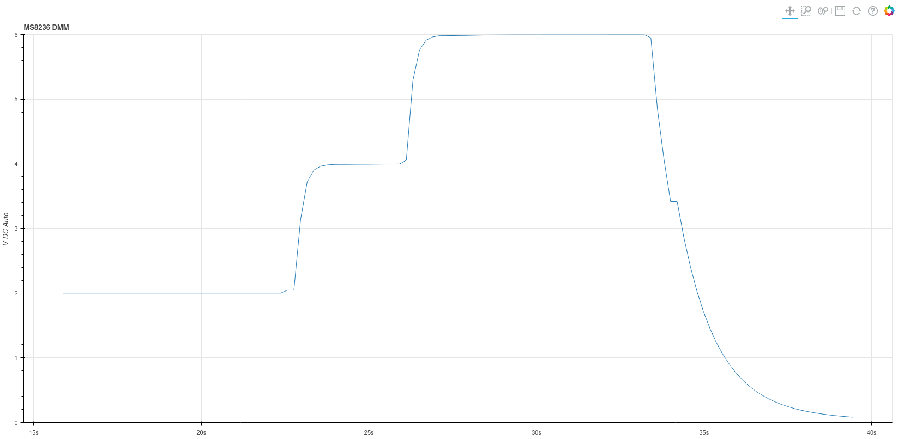

# HYLEC MS8236 Data Logging Tool
This project provides a command line tool to record and polt data from the HYLEC MS8236 Digital MultiMeter.
The tool is written in python.

# Installation
Currently an installer is available for Linux systems. The python code should run on Windows but has not been tested and no installer currently exists for a Windows platform.

## Installing the debian package
- Download the packages/python-ms8236-1.1-all.deb. The version (currently 1.1) of the package may change.
- Install the package from a terminal window on your machine as shown below.
```
sudo dpkg -i python-ms8236-1.1-all.deb
```

#Running the dmm command
Once installed the dmm command is available on the command line. The dmm command has command line help as shown below.

```
dmm -h
usage: dmm.py [-h] [-d] [-p PORT] [-l LOG] [-t] [-f] [-r RANGE]

Log data from the HYLEC MS8236 DMM.
This DMM has a USB interface over which data can be sent.
The program allows you to record and plot this data on a connected PC.

optional arguments:
  -h, --help            show this help message and exit
  -d, --debug           Enable debugging.
  -p PORT, --port PORT  Serial port (default=/dev/ttyUSB0).
  -l LOG, --log LOG     Log file (default=/home/pja/hylec_ms8236.log).
  -t, --plot            Plot data in real time.
  -f, --fplot           Plot data from log file.
  -r RANGE, --range RANGE
                        The Y axis range. By default the Y axis will auto range. If defined then a comma separated list of min,max values is required. (E.G 0,10)

Example
dmm -p /dev/ttyUSB1 --log /tmp/dmm.log --plot
```

Log data from the meter to a log file.

```
dmm --log /tmp/log.txt

INPUT: Overwrite /tmp/log.txt y/n: y
INFO:  Deleted /tmp/log.txt
INFO:  Created /tmp/log.txt
INFO:  LOG: /tmp/log.txt
INFO:  Open serial port: False
INFO:  Opened serial port
INFO:  06/04/2021-18:50:01.206700: 5.439 V DC Auto 
INFO:  06/04/2021-18:50:01.403154: 5.439 V DC Auto 
INFO:  06/04/2021-18:50:01.599601: 5.439 V DC Auto 
INFO:  06/04/2021-18:50:01.796386: 5.439 V DC Auto 
INFO:  06/04/2021-18:50:01.996980: 5.439 V DC Auto 
INFO:  06/04/2021-18:50:02.193446: 5.439 V DC Auto 
INFO:  06/04/2021-18:50:02.390302: 5.439 V DC Auto 
INFO:  06/04/2021-18:50:02.586624: 5.439 V DC Auto 
INFO:  06/04/2021-18:50:02.783601: 5.439 V DC Auto 
INFO:  06/04/2021-18:50:02.980141: 5.439 V DC Auto 
INFO:  06/04/2021-18:50:03.176759: 5.439 V DC Auto 
INFO:  06/04/2021-18:50:03.372893: 5.439 V DC Auto 
INFO:  06/04/2021-18:50:03.574263: 5.439 V DC Auto 
INFO:  06/04/2021-18:50:03.770687: 5.439 V DC Auto 
INFO:  06/04/2021-18:50:03.967283: 5.439 V DC Auto 
INFO:  06/04/2021-18:50:04.167987: 5.439 V DC Auto 
INFO:  06/04/2021-18:50:04.364696: 5.439 V DC Auto 
INFO:  06/04/2021-18:50:04.561306: 5.439 V DC Auto 
INFO:  06/04/2021-18:50:04.757963: 5.439 V DC Auto 
INFO:  06/04/2021-18:50:04.954559: 5.439 V DC Auto
```

It is possible to plot the DMM status of the DMM output as shown below.

```
dmm --log /tmp/log.txt --plot -r 0,6
```

While the above output is displayed on in the terminal window a GUI will report the value on the DMM .



# Python
This software requires that python3.8 is installed on the host computer. 
Python3.8 can be installed on Debian based machines using the following steps.

```
sudo apt install build-essential zlib1g-dev libncurses5-dev libgdbm-dev libnss3-dev libssl-dev libreadline-dev libffi-dev libsqlite3-dev wget curl
sudo apt install libssl-dev libffi-dev
cd /tmp
curl -O https://www.python.org/ftp/python/3.8.2/Python-3.8.2.tar.xz
tar -xf Python-3.8.2.tar.xz
cd Python-3.8.2
./configure --enable-optimizations
sudo make altinstall
```

# Building debian package

pipenv2deb must be installed in order to build this package. See https://github.com/pjaos/pipenv2deb for details.

```
sudo pipenv2deb --rpm --tgz
INFO:  Removed build path
INFO:  Set executable attribute: create_pip_env.sh
INFO:  Created build/DEBIAN
INFO:  Created build/usr/local/bin/python-ms8236.pipenvpkg
INFO:  Copied /scratch/git_repos/python3/dmm_hylec_ms8236/open_source_libs to build/usr/local/bin/python-ms8236.pipenvpkg/open_source_libs
INFO:  Copied /scratch/git_repos/python3/dmm_hylec_ms8236/images to build/usr/local/bin/python-ms8236.pipenvpkg/images
INFO:  Copied Pipfile to build/usr/local/bin/python-ms8236.pipenvpkg
INFO:  Copied Pipfile.lock to build/usr/local/bin/python-ms8236.pipenvpkg
INFO:  Set executable attribute: build/usr/local/bin/python-ms8236.pipenvpkg/create_pip_env.sh
INFO:  Copied /scratch/git_repos/python3/dmm_hylec_ms8236/dmm.py to build/usr/local/bin/python-ms8236.pipenvpkg
INFO:  Creating build/DEBIAN/postinst
INFO:  Set executable attribute: build/DEBIAN/postinst
INFO:  Set executable attribute: build/DEBIAN/control
INFO:  Set executable attribute: build/DEBIAN/postinst
INFO:  Created: build/usr/local/bin/dmm
INFO:  Set executable attribute: build/usr/local/bin/dmm
INFO:  Executing: dpkg-deb -Zgzip -b build packages/python-ms8236-1.1-amd64.deb
dpkg-deb: building package 'python-ms8236' in 'packages/python-ms8236-1.1-amd64.deb'.
INFO:  Executing: sudo alien --to-rpm --scripts python-ms8236-1.1-amd64.deb
python-ms8236-1.1-2.x86_64.rpm generated
INFO:  Created rpm file from deb
INFO:  Executing: sudo alien --to-tgz --scripts python-ms8236-1.1-amd64.deb
python-ms8236-1.1.tgz generated
INFO:  Created tgz file from deb
INFO:  Removed build path
```

This leaves a *.deb, *.rpm and a *.tgz file in the packages folder. The installation of the *.deb and *.rpm files is detailed above. The *.tgz file could be used as the basis for an installer on other platforms (E.G  Windows).
